<picture>
  <source media="(prefers-color-scheme: dark)" srcset="assets/banner-dark.svg">
  
</picture>

### Now

- Designing a single glass material for my whole desktop — Hyprland, Quickshell, one palette from the wallpaper
- Keeping that desktop reproducible from zero in [`dotfiles`](https://github.com/aleksandr-mazhul/dotfiles)
- Studying mathematics at BSU, mostly through code

### Toolbox

TypeScript · Python · Java · C++ · Bash &nbsp;&nbsp;/&nbsp;&nbsp; Arch Linux · Hyprland · Quickshell · Neovim · Git

 

<picture>
  <source media="(prefers-color-scheme: dark)" srcset="assets/activity-dark.svg">
  
</picture>
